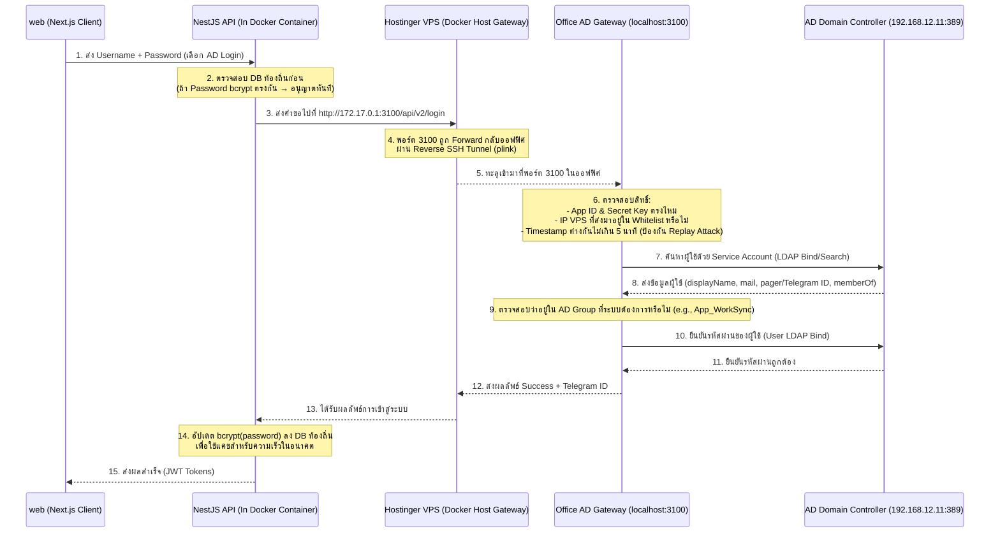

# คู่มือการตั้งค่าระบบ Active Directory Authentication บน Hostinger VPS
เอกสารนี้อธิบายสถาปัตยกรรม วิธีการทำงาน และขั้นตอนในการเชื่อมต่อระบบของโครงการต่างๆ บน VPS (เช่น **WorkSync**, **ProRegis**) เข้ากับระบบ Active Directory (AD) ภายในออฟฟิศผ่าน **AD Gateway (ADSyncAgent)** และ **Reverse SSH Tunnel** โดยไม่ต้องเปิดพอร์ตหรือเผยแพร่ Domain Controller ออกสู่อินเทอร์เน็ตสาธารณะ

---

## 🏗️ 1. สถาปัตยกรรมการเชื่อมต่อ (Architecture Overview)

เนื่องจากระบบ **Active Directory Domain Controller** (IP `192.168.12.11`) ตั้งอยู่ภายในเครือข่ายภายในของออฟฟิศ (On-Premise) ซึ่งเครื่อง VPS บน Hostinger ไม่สามารถเข้าถึงโดยตรงได้ จึงต้องใช้ **Reverse SSH Tunnel** ร่วมกับ **AD Gateway (ADSyncAgent)** ดังแผนภาพนี้:



---

## 🛠️ 2. เงื่อนไขและข้อกำหนดในการใช้งาน (Prerequisites)

เพื่อให้ระบบเชื่อมต่อได้ ต้องมีองค์ประกอบครบ 3 ส่วนหลัก ดังนี้:

### 1) การเชื่อมต่อเน็ตเวิร์ก (Network Tunneling)
* **Reverse SSH Tunnel** ต้องทำงานอยู่ตลอดเวลา โดยรันจากฝั่งออฟฟิศเพื่อ forward พอร์ตของ VPS กลับมาที่เครื่องในออฟฟิศ
* ในเครื่องออฟฟิศจะใช้เครื่องมือเช่น **plink.exe** (หรือ ssh บน Linux) ในการสร้างการเชื่อมต่อแบบ loop เพื่อรีสตาร์ทตัวเองหากหลุด:
  ```bash
  plink.exe -i "C:\ADSyncAgent\.ssh\id_rsa.ppk" -batch -N -R 3100:localhost:3100 -R 3200:localhost:3200 root@<VPS_IP>
  ```
  *(จากคำสั่งด้านบน พอร์ต **3100** ของ VPS จะเชื่อมเข้ากับพอร์ต **3100** ของเครื่อง AD Gateway ในออฟฟิศ)*

### 2) เครื่อง AD Gateway ในออฟฟิศ (ADSyncAgent Node.js App)
* ต้องเปิดบริการ Express API บนพอร์ต `3100` ตลอดเวลา (มักใช้ PM2 ในการจัดการ)
* สามารถเข้าถึง Active Directory Domain Controller (`ldap://192.168.12.11`) ได้ผ่านโปรโตคอล LDAP (พอร์ต 389)

### 3) การตั้งค่าภายใน Docker บน VPS
* เนื่องจาก API รันอยู่ใน Docker Container บน VPS เพื่อให้มันติดต่อพอร์ต 3100 ของ Host VPS ได้ มันจะต้องวิ่งผ่าน IP Gateway ของ Docker Bridge คือ `172.17.0.1` 
* ดังนั้น URL ของ AD Gateway ที่ตั้งค่าใน `.env` ฝั่ง VPS จึงต้องเป็น:
  ```env
  AD_GATEWAY_URL="http://172.17.0.1:3100/api/v2/login"
  ```

---

## 📝 3. ขั้นตอนการเพิ่ม Project ใหม่เข้าใช้งาน (เช่น ProRegis)

หากคุณต้องการนำโครงการอื่น (เช่น **ProRegis**) มาใช้ระบบ Authen AD ตัวเดียวกันนี้บน VPS ตัวเดียวกัน คุณไม่จำเป็นต้องติดตั้ง AD Gateway หรือสร้าง SSH Tunnel ใหม่ ให้ปฏิบัติตามขั้นตอนต่อไปนี้ได้เลย:

### ขั้นตอนที่ 1: ลงทะเบียน App ใหม่ใน `registry.json` ของ AD Gateway (ออฟฟิศ)
ไปที่เครื่อง AD Gateway ในออฟฟิศ เปิดไฟล์ [registry.json](file:///d:/Python/ADSyncAgent/registry.json) เพื่อเพิ่มข้อมูลแอปพลิเคชันของคุณ เช่น:

```json
[
  {
    "app_id": "worksync",
    "secret_key": "EAAD6F0F70CE84DF67037F2D835511927D964493B7BB986C61CF20272D9A87EC",
    "allowed_ips": ["157.173.219.153"],
    "required_group": "App_WorkSync"
  },
  {
    "app_id": "ProRegis",
    "secret_key": "d69f9e5a88e734c56e2978a63bf720c22635a9c0c32b5e2a2205510657e4e138",
    "allowed_ips": ["157.173.219.153"],
    "required_group": "App_ProRegis"
  }
]
```
> [!IMPORTANT]
> * **allowed_ips**: ใส่ IP สาธารณะของ VPS Hostinger เพื่อล็อกให้เฉพาะ VPS เรียกเข้ามาได้เท่านั้น (เพื่อความปลอดภัยสูงสุด)
> * **required_group**: กลุ่มใน Active Directory ที่สมาชิกเท่านั้นจะสามารถเข้าใช้แอปนี้ได้ (เช่นสร้างกรุ๊ป `App_ProRegis` ใน AD แล้วเอาผู้ใช้ที่ต้องการให้มีสิทธิ์เข้าถึงใส่เข้าไปในกรุ๊ปนี้)

ทำการบันทึกและรันคำสั่งรีสตาร์ทบริการ AD Gateway เพื่อโหลดการตั้งค่าใหม่:
```bash
pm2 restart ad-sync-agent
```

---

### ขั้นตอนที่ 2: ตั้งค่าข้อมูลในไฟล์ `.env` ของโครงการใหม่บน VPS
ไปที่ VPS หรือแก้ไขไฟล์ `.env` ของ API ของแอปพลิเคชันใหม่ (เช่น [ProRegis API .env](file:///d:/Python/ProRegis/api/.env)) เพื่อชี้มาที่ AD Gateway ผ่าน SSH Tunnel:

```env
# ตั้งค่าชี้ไปยัง Docker Host Gateway พอร์ต 3100
AD_GATEWAY_URL="http://172.17.0.1:3100/api/v2/login"
AD_APP_ID="ProRegis"
AD_SECRET_KEY="d69f9e5a88e734c56e2978a63bf720c22635a9c0c32b5e2a2205510657e4e138"
```
*(หมายเหตุ: บนเครื่อง Local ตอนพัฒนา ถ้าอยู่ในเครือข่ายออฟฟิศ สามารถชี้ไปยัง IP เครื่อง AD Gateway ตรงๆ ได้ เช่น `http://192.168.12.11:3100/api/v2/login` แต่เมื่อเอาขึ้น VPS ต้องเปลี่ยนเป็น `http://172.17.0.1:3100/api/v2/login` เสมอ)*

---

### ขั้นตอนที่ 3: คัดลอกและประยุกต์ใช้โค้ดเรียกใช้งาน (API Request Flow)
นำส่วน logic การตรวจสอบ AD Login ไปไว้ในส่วนของ Auth Service ของแอปพลิเคชันใหม่ โดยสร้าง request payload ในรูปแบบเดียวกัน:

#### ตัวอย่างโค้ดฝั่ง Backend (NestJS / TypeScript)
```typescript
private async authenticateViaADGateway(
  username: string,
  password: string,
): Promise<{ success: boolean; token?: string; message?: string }> {
  const gatewayUrl = this.configService.get<string>('AD_GATEWAY_URL');
  const appId = this.configService.get<string>('AD_APP_ID');
  const secretKey = this.configService.get<string>('AD_SECRET_KEY');

  // จัดรูปแบบ ISO timestamp +7 ชม. (เวลาไทย) เพื่อส่งไปให้ Gateway ตรวจสอบ Replay Attack
  const tzoffset = 7 * 60 * 60 * 1000;
  const localTime = new Date(Date.now() + tzoffset);
  const timestampStr = localTime.toISOString().split('.')[0] + 'Z';

  const payload = {
    app_id: appId,
    secret_key: secretKey,
    username,
    password,
    timestamp: timestampStr,
  };

  try {
    const res = await fetch(gatewayUrl, {
      method: 'POST',
      headers: { 'Content-Type': 'application/json' },
      body: JSON.stringify(payload),
      signal: AbortSignal.timeout(10000), // timeout 10 วินาที
    });

    const responseText = await res.text();
    if (!res.ok) {
      let message = `AD Gateway returned status ${res.status}`;
      try {
        const err = JSON.parse(responseText);
        message = err.message || message;
      } catch {}
      throw new Error(message);
    }

    const result = JSON.parse(responseText);
    return {
      success: result.status === 'success',
      token: result.token,
    };
  } catch (err: any) {
    throw new Error(err.message || 'ไม่สามารถเชื่อมต่อ AD Gateway ได้');
  }
}
```

---

## 🔒 4. มาตรการด้านความปลอดภัยที่ได้รับการออกแบบไว้

1. **การจำกัด IP (IP Whitelist):**
   * ระบบ Gateway จะทำการตรวจเช็ค IP ต้นทางจาก API Request เสมอ โดยจะอนุญาตเฉพาะ IP VPS ที่ลงทะเบียนไว้ใน `registry.json` เท่านั้น
2. **การป้องกัน Replay Attacks (Timestamp Verification):**
   * ทุกคำขอจะต้องแนบเวลาปัจจุบันส่งมาด้วย ซึ่ง AD Gateway จะอนุญาตให้ความต่างของเวลาระหว่างเซิร์ฟเวอร์ VPS และเครื่องในออฟฟิศคลาดเคลื่อนกันได้ไม่เกิน 5 นาที (300,000 ms) หากเกินกว่านั้นระบบจะตัดสิทธิ์ปฏิเสธทันที
3. **ระบบแคชรหัสผ่านในเครื่อง (Local Backup Authen):**
   * เมื่อเข้าสู่ระบบสำเร็จผ่าน AD เป็นครั้งแรก ระบบจะนำรหัสผ่านนั้นมาทำการแฮชด้วย `bcrypt` แล้วบันทึกเก็บไว้ในฐานข้อมูลท้องถิ่นของโปรเจกต์ (เช่น PostgreSQL)
   * หากในการล็อกอินครั้งต่อๆ ไป รหัสผ่านตรงกับตัวที่แคชไว้ ระบบจะข้ามการเรียกไปหา AD Gateway เพื่อความรวดเร็วและเพิ่มความเสถียร (หาก VPN หรือ SSH Tunnel เกิดหลุดชั่วคราว ผู้ใช้ก็จะยังเข้าสู่ระบบได้ปกติ)
4. **ความปลอดภัยของสิทธิ์ใน AD:**
   * บัญชี Service Account (`AD_BIND_DN`) ที่ใช้เป็นเพียงบัญชีทั่วไปที่มีสิทธิ์แบบ **Read-Only** ในการอ่านค่าผู้ใช้และกลุ่มเท่านั้น ไม่ต้องใช้สิทธิ์ Domain Admin ป้องกันกรณีที่ Gateway ถูกบุกรุก

---

## 🔍 วิธีการตรวจสอบสถานะ (Troubleshooting)

หากโครงการอื่นๆ บน VPS พยายามเรียกใช้งานแล้วเกิดปัญหา ให้ตรวจสอบตามจุดเหล่านี้:

* **ตรวจสอบ SSH Tunnel บน VPS:**
  ล็อกอินเข้า VPS แล้วเช็คว่ามี Tunnel สตรีมที่พอร์ต 3100 อยู่จริงหรือไม่:
  ```bash
  ss -tlnp | grep 3100
  ```
  *(ควรเห็นพอร์ต 3100 ถูก bind โดยกระบวนการ ssh/sshd หรือ plink บน VPS)*

* **ตรวจสอบการรันของ Gateway ในออฟฟิศ:**
  ตรวจสถานะบริการ PM2 หรือ logs ของ AD Gateway:
  ```bash
  pm2 status
  pm2 log ad-sync-agent
  ```

* **ตรวจสอบความถูกต้องของ Time Sync บน VPS และฝั่งออฟฟิศ:**
  เนื่องจากมีการเช็ค Timestamp หากระบบเวลาของ VPS คลาดเคลื่อนจากเวลาของเซิร์ฟเวอร์ออฟฟิศเกิน 5 นาที คำขอจะถูกยกเลิก (แก้ไขโดยการเปิดใช้ ntp/chrony เพื่อซิงก์เวลากลางบน VPS และเซิร์ฟเวอร์ในออฟฟิศ)
